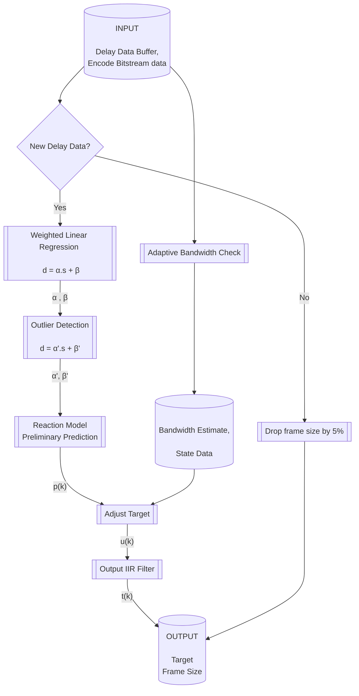
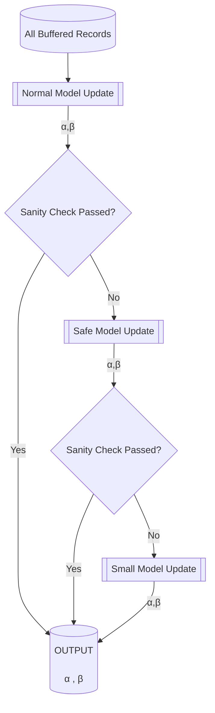
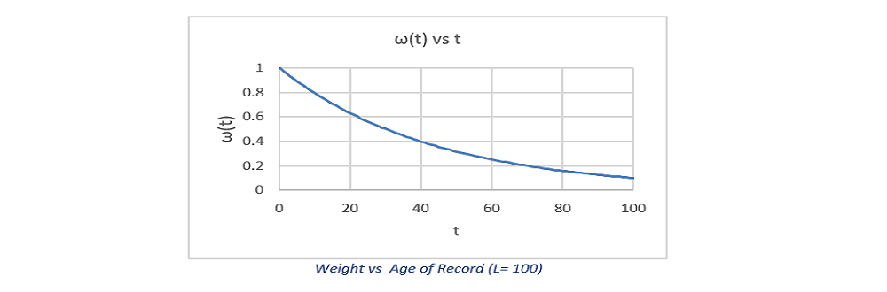
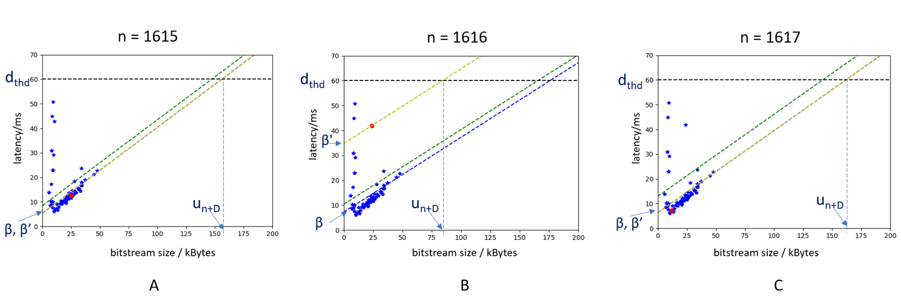
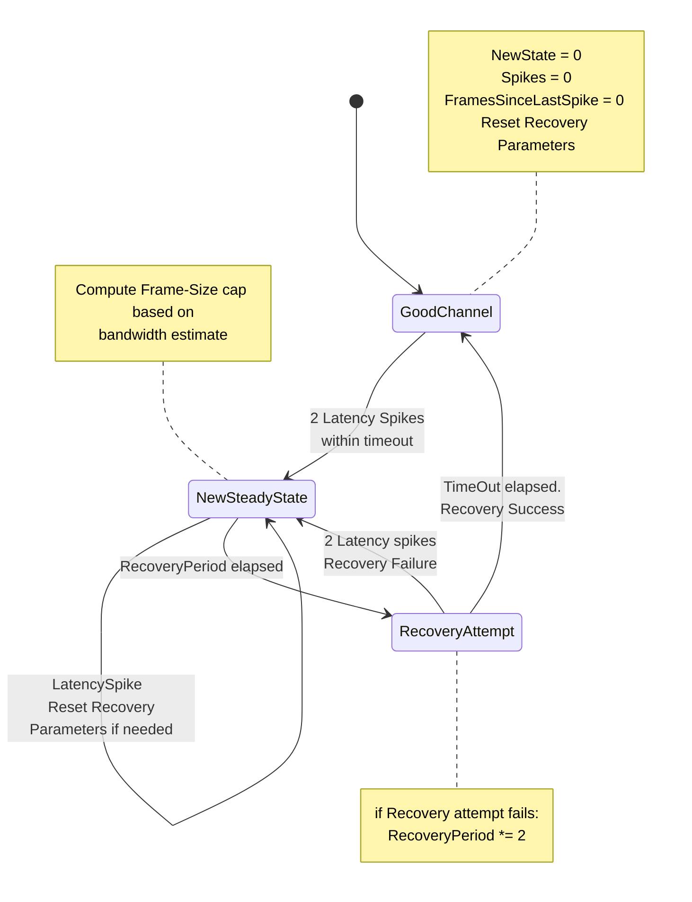
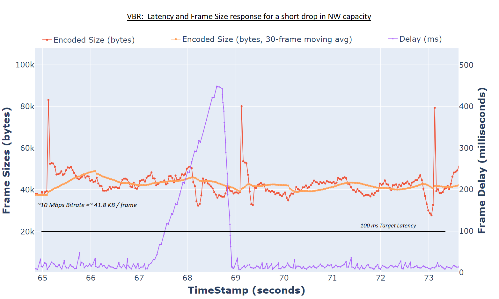
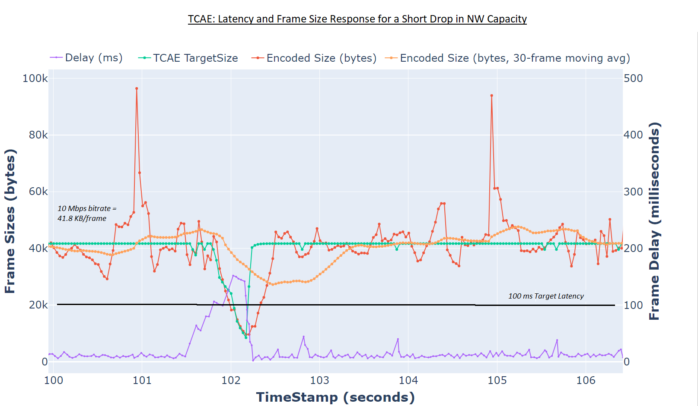
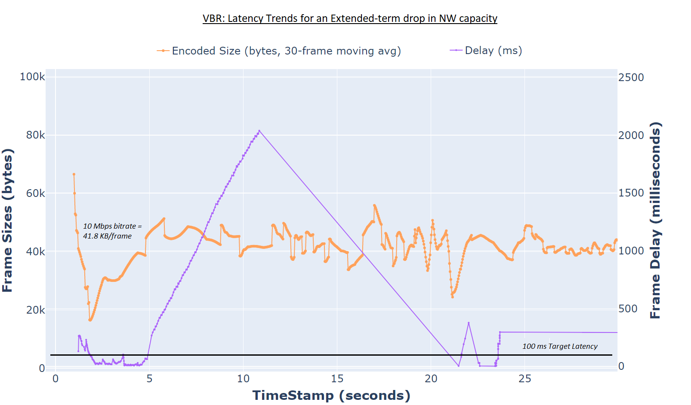
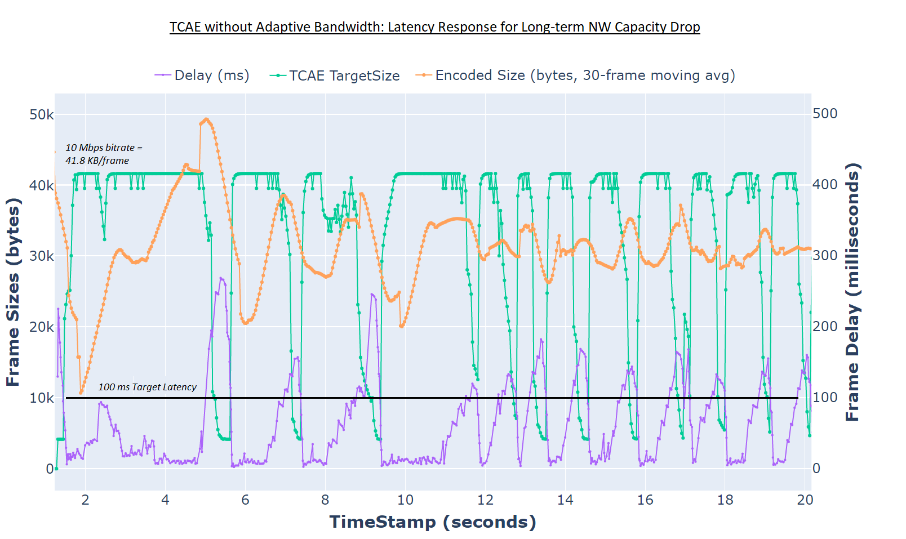
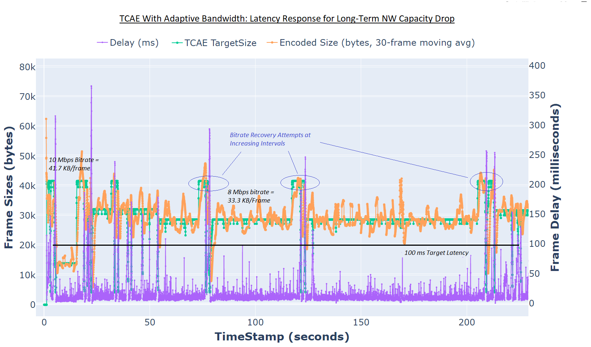

# Transport & Content Adaptive Encode (TCAE)

## Introduction

Experiments show that there is a sharp increase in the latency of
packets received by a client when the network throughput drops below the
rate at which the packets are generated by the server. In usage models
such as Network Gaming or Real-time Video streaming, such an increase in
latency implies poor user experience to the point of failure.
The Android and Windows Cloud Gaming solutions, which target the 
Intel® Data Center GPU Flex series are good examples of a usage model
where the user experience is extremely sensitive to overall latency
in the system.

Transport and Content Adaptive Encode (TCAE) feature and the closely
associated Transport Controlled Bitrate Control (TCBRC) are intended to
help mitigate this problem.

### TCBRC

The key idea is that the Bitrate control (BRC) module deployed in the
Intel Media Driver runs in a mode that adjusts bitrate on a per-frame
basis. This feature runs without the need of an expensive "BRC-reset"
that reinitializes the BRC with new configuration parameters to adjust
to the instantaneous network capacity. The app-layer of the SW stack is
expected to provide feedback related to network capacity through the
Device Driver Interface (DDI).

The default Variable BitRate Control mode (VBR) is a more generic
bit-rate control mechanism: It allows for Maximum and Average bitrates
to be specified dynamically (adaptive bitrate feature), but these
parameters adapt relatively slowly across several frames. VBR doesn't
allow frame-specific targets/constraints without a BRC-reset, or in some
cases -- introduction of an IDR frame. In other words, TCBRC offers the
advantage of much faster adaptation to new bit-rate requirements than
VBR and is more suited for a latency-sensitive usage scenario.

### TCAE

The input parameters for TCBRC are expected to be generated by the
application and fed in through the DDI for the Media UMD (or through
OneVPL APIs, which takes care of interfacing the Media UMD). Here, the
customer apps are free to bring in their own IP and implement this in
any suitable manner of their choice. Apps are envisioned to take several
variables into account including network conditions and complexity of
the content in play,and use a suitable algorithm to translate this to
what the UMD expects to enable TCBRC. This process/idea is referred to
as "Transport and Content Adaptive Encode" (TCAE).

Generally speaking, a TCAE implementation at the minimum is expected to
generate a prediction of the frame rate to be delivered by the Encoder
to match the network capability. This can further be extended to take
advantage of more advanced encoding features supported by the Intel
Media Driver SW stack.

## Reference TCAE Implementation

A reference TCAE implementation that generates a target size on a
per-frame basis is provided with both the Windows and Android Cloud
Gaming (CG) solutions - officially termed the \"Cloud Gaming Reference
Stack for Windows\" and the \"Intel Cloud Streaming System Software on
Android (ICS3A)\" respectively.

The feature is enabled by default in the Video Encoder service for both
solutions.
* In the Windows Cloud Gaming solution, it is available as part of the
  Intel® QSV Capture and Stream SDK.
* In ICS3A, it is directly integrated into the [Video Encoder Service](../sources/encoder).
In both cases, the encode apps enable TCAE to predict the instantaneous
bitrate (from frame size) at which encoder should deliver the bitstream.

### Client App Support

TCAE requires a client application that is capable of generating TCAE
feedback data. The required feedback data needs to be supplied in the
format specified by the pre-defined [Control Protocol for Frame
Stats](control_protocol_spec.rst#framestats/).

-   The critical data to supply is in the `framesize` and`framedelay`
    fields of the structure. (The rest can be zero)
-   It is the responsibility of the client application to generate
    accurate data that reflects the size and network latency of the
    packets received. At the minimum, both these fields should be
    positive integers.

The default recommended client applications packaged with the Windows
and Android solutions both support this feedback. TCAE is triggered only
after at least one valid packet of this feedback.

### Bandwidth Adaptivity

The core part of the reference TCAE implementation is primarily devised
as a transient response to occasional drops in network bandwidth. This
assumes that the bitrate requested takes into account the capacity of
the network in use.

-   If that isn\'t the case, and the network throughput is consistently
    below the bitrate requested, the transient nature of this response
    can lead to a pattern where the latency is rising and then falling
    in a cycle. An example is provided in the TCAE result in the section  
    on [TCAE Performance Evaluation](#case-2a-long-term-network-capacity-drop-without-bandwidth-adaptivity).

To mitigate against this, the TCAE algorithm also includes an
enhancement to stabilise the bitrate generated to an estimated
averagevalue of the network capacity if such an oscillation observed.
This enhancement is referred to as \"Bandwidth Adaptivity\".

-   Bandwidth adaptivity is enabled by default when TCAE is enabled. To
    disable this enhancement, pls see below section on Control settings.

### App-Level Control Settings

The parameters that need to be configured for explicit control on the
server side are listed below for each of the CG stacks.

**Android**

The relevant parameters need to be provided on the ICR Encoder command
line. A sample command line is provided below.

-   `-tcae 1` to enable it, and `-tcae 0` to disable the feature.
    (Enabled by default). Note that `ratectrl` parameter must be set to
    VBR to enable TCAE.
-   `tcae_log_path <path>` to specify a path to generate a TCAE event
    log. More info on this in the section on logging (Disabled by
    default).
-   The `maxrate` parameter needs to be programmed explicitly to specify
    the ideal bitrate that should be used by TCAE. This should be
    greater than or equal to the target bitrate (specified by the 
    `-b` option)

```
    icr_encoder $i -streaming -res 1280x720 -fr 30 -url irrv:264 -plugin qsv -quality 4 \
    -ratectrl VBR -b 7.5M -maxrate 8M -tcae 1 -hwc_sock /opt/workdir/ipc/hwc-sock -tcae_log_path /home/user/tcaeEvents.log
```

**Windows**

In Windows, the [config files](../sources/streamer/config/) need to be
updated to capture similar settings.

Select the relevant config file for the use case, and edit each of below
settings as required:

-   `enable-tcae = <true/false>` to enable / disable TCAE. (Enabled by
    default). Note that `video-rc = vbr` is required if TCAE is enabled.
    (Default)
-   `video-specific[b] = <target>` to set TCAE Target bitrate. Note that
    this is also used to set VBR Target bitrate for cases where TCAE is
    not enabled.
-   `netpred-target-delay = <integer>` to configure the target latency
    (in ms) at which TCAE starts suppressing frame size in response.
    Default value = 30. Recommended to leave this unchanged unless for
    experimentation.
-   `netpred-records = <integer>` to configure the number of most recent
    data points that will be factored in determining the target bitrate.
    Default value = 100. Recommended to leave this unchanged unless for
    experimentation.

Event logs in Windows are disabled by default. Set environment variable
`TCAE_LOG_ENABLE=1` to generate logs at `C:\Temp\tcaeLogs_PID.log` (PID
is replaced by the runtime process ID for the TCAE thread).

### Logging and Debug Controls

**Latency Logs**

Logging options are available for developers as a debug feature to study
the results and devise improvements. TCAE logs provide basic capability
to capture the network latency data received from the client application
and the response of the encoder.

The controls to enable logging are provided in the above section on
Control parameters. The logs generated are a time-stamped summary of
relevant events in csv format. Here is a sample output:

    FrameDelay,FrameSize,EncSize,PredSize,Feedback_FrameNumber,EncoderThread_FrameNumber,RelativeTimeStamp,Function
    ...
    11650, 37968, 0, 0, 1, 57, 969578, UpdateClientFeedback
    1295, 3177, 0, 0, 2, 57, 980133, UpdateClientFeedback
    0, 0, 0, 16666, 3, 57, 980994, GetTargetSize
    0, 0, 4072, 16666, 3, 57, 984291, UpdateEncodedSize
    7937, 479, 0, 0, 4, 58, 992027, UpdateClientFeedback
    0, 0, 0, 16666, 5, 58, 997961, GetTargetSize
    0, 0, 3525, 16666, 5, 58, 1001358, UpdateEncodedSize
    ...

These logs are not enabled with VBR. A debug feature is available in
both Windows and Android stacks to generate these latency logs for
VBR(for debug/ comparison vs TCAE).

-   To do this, the encoder needs to be run with TCAE enabled, and in
    addition set an environment variable `BRC_OVERRIDE_MODE=1`. This has
    the effect of running the encoder in VBR mode without TCAE, but
    enables logs for client-reported latency and Encoder response.

**Turn off Bandwidth Adaptivity**

The Bandwidth Adaptivity feature is enabled by default. To disable, the
server app needs to be run with environment variable
`TCAE_STEADY_STATE_CHECK=0`.

**Additional Debug Logging**

Additional logs related to the core part of the algorithm can be enabled
with envrironment variable `TCAE_NETPRED_DUMPS=1`. Note that these are
meant to generate traces to debug problems, and not recommended to be
enabled in normal usage flows.

### Limitations and Possible Extensions

*  The reference implementation is limited to a single-layer encode
   design in its current form.
*  The current design is also limited to determining a target size for
   each frame, and passing that along to the encoder.

This can be extended to more sophisticated designs, that have TCAE output
recommendations for IDR frame insertion, dropping frames, resolution change
etc. The design expectation here is that the app responds appropriately
to these recommendations and does the needful next steps in invoking
relevant OneVPL / Media UMD APIs to implement the feature completely.
    

## Software Architecture for Reference Implementation

This section details how the reference TCAE implementation is interfaced
with the rest of the encoder application and describes the architecture
of the implementation.

The core algorithm implemented and the key application interfaces are
equivalent for both the Android and Windows Cloud Gaming stacks. The
data and application flow involved are ultimately the same. However,
since the TCAE implemention for Windows is within the Intel® QSV Capture
and Stream SDK layer, the app needs to package the same data and
settings through the interfaces defined by this SDK. The description
below is based on the Android definition, but it should be
straight-forward to map these to the Capture SDK equivalents.

### TCAE Functions

The `PredictorTcaeImpl` class (declared in 
[enc\_frame\_settings\_predictor.h](../sources/encoder/shared/tcae/enc_frame_settings_predictor.h))
captures the interface to the TCAE functions.
In windows, this class, with minor interface differences makes
up the Intel® QSV Capture and Stream SDK interface for TCAE. The
important functions exposed in this class are the following:

-   `tcaeStatus  Start(TcaeInitParams_t* params);` : Initializes the
    TCAE object with required settings. The following parameters are set
    as part of this call.
    -   `featuresSet` : TCAE features enabled. Default Value =
        `TCAE_MODE_STANDALONE` (only value validated)
    -   `targetDelayInMs` : Value (in milliseconds) below which TCAE
        aims to keep the network latency. Non-zero input is expected.
    -   `bufferedRecordsCount`: Number of client feedback points to
        factor into the TCAE response. (Default value = 100)
-   `tcaeStatus UpdateNetworkState(PerFrameNetworkData_t* data);`:
    Updates the \"Delay Data\" buffer structure with feedback sent
    (asynchronously) from the client. This function acts as the producer
    for this shared buffer. Expected to be called for every receipt of
    client feedback data.
-   `tcaeStatus BitstreamSent(EncodedFrameFeedback_t* bts);` : Records
    the size of the frame that is encoded and streamed over the network
    in the \"Encoded Bitstream size\" buffer. Expected to be called
    after every encoded frame.
-   `tcaeStatus PredictEncSettings(FrameSettings_t* perFrameSettings);`
    : This call runs the TCAE algorithm and generates a target frame
    size (in bytes) for the current frame. This call is the consumer for
    the \"Delay Data\" and the \"Encoded Bitstream size\" shared
    buffers. It updates the \"Reaction model\" used by the algorithm
    with the latest client feedback data.
-   `tcaeStatus Stop();`: Reset all parameters, and clear the shared
    buffers. Invoked as part of the class destructor.

### Application Interface and Data Flow

The sequence diagram below shows how these functions (green highlight) fit
into the architecture of the encoder, along with the data flow involved. Note
that the functions named and thread architecture represented in this diagram
are specific to the Android stack. The TCAE functions described above are
called from two threads that are part of the Encoder application. The
Windows CG stack has two equivalent threads that invoke the TCAE functions
in a similar manner.


After receipt of frame number $n$ in the bitstream (lets say it is encoded
with size $s_n$ bytes), the client asynchronously returns the bitstream
size and the transport latency $d_n$ of the frame. The size returned by
the server may be slightly different from $s_n$ and is denoted by $s'_n$.
The reasons for the difference are transport related and out of scope of
this document. The data $(s_n, d_n)$ is queued into a shared buffer i.e.
\"Delay Data buffer\" by invocation of the `UpdateNetworkState`
function.

At this point, the encoding thread can be ahead by some frames (denoted by
variable $D$), and new frame indexed $k = n + D$ is ready for encode. The
encoding thread invokes the TCAE algorithm through the `PredictEncSettings`
call. This results in the TCAE object dequeing the items in the Delay Data
shared buffer and processing them to determine a target frame size $t_k$
for the current frame. $t_k$ is then passed to the Media driver as part of
the encode submission. 

See the section on [Software Interfaces for TCBRC](#SDK-Level-Interface)
for more info on the specific structures involved.


## Algorithm for Reference TCAE implementation

This section describes the algorithm that goes into determining the target
frame size upon invocation of the `PredictEncSettings` function. This call
consumes the available data in the Delay Data buffer upto that point, and
buffers the data internally. The most recent L samples in this buffer are
considered in making the frame size prediction, where`L=BufferedRecordsCount`
(default value 100). The flow-chart below describes the steps involved in
determining the target frame size. The rest of this section provides more
details for each step.

**Note: Notation $f(n)$ and $f_n$ is used interchangably.**



If there are no new feedback samples available to consume at the point of
invocation, then an early exit is taken, with the target frame size dropped 
by 5% i.e. $t_k = 0.95 \cdot t_k-1$. In this path, the target frame size goes
from maximum (corresponds to 100% of target bitrate) to the minimum (10% of
target bitrate specified) in about 45 frames.

If there is new feedback data available, the target frame size is computed
by the following steps. 
- A `Weighted Linear Regression (WLR)` process is run to curve-fit the
  data samples into a linear model defined by parameters α and β

  $$d_n = α \cdot s'_n + β$$
 
- For a given frame, the final values of α, β are adjusted to α',β’ to account 
  for the results of an `Outlier Detection` step that follows WLR. With the
  model now in place, a preliminary target size prediction $p_k$ is generated
  for the given `TargetDelay`.
- The target size is adjusted to $u_k$` based on safeguards to ensure an
  output in the expected valid range of values, and the results of the
  Adaptive Bandwidth Check feature, if enabled.
- The `Adaptive Bandwidth Check` block tracks the Delay data buffer and 
  the Encoded bitstream data buffer to check if there is a latency pattern 
  that indicates that the network has a steady bandwidth that is lower than
  the target bitrate. If yes, the estimated bandwidth and other state info
  captured by this block are also taken into account to determine $u_k$.
- An `Output IIR Filter` is then run to refine $u_k$ to the final target
  $t_k$. The filter co-efficient controls how quickly the target size can
  change over time.

### Latency Model and Weighted Linear Regression

In this TCAE implementation, the relationship between latency (d) and bitstream
size (s) is approximated by a linear model expressed as: 

$$d = α \cdot s + β \tag{1}$$

* $α = (1/BandWidth)$ and is defined as the `Inverse Bandwidth`. The α.s term
  covers the Transmission latency: this linearly varies with bitstream size.
* β is referred to as the `Propagation Delay` in a simplified sense. It is
  intended to cover for all other types of delay in the system including the
  network propagation delay, response latency, software latency, etc. This is
  not related to the bitstream size.

The `Weighted Linear Regression (WLR)` block is meant to estimate the
parameters α and β, by curve-fitting (1) with the last L buffered
records of (size, latency) data pairs $(s’_n, d_n))$ with the least
mean-squared error (MSE). This is expressed mathematically as follows:

``` math
(α,β) = \underset{(α,β)} {argmin} \sum_ {t=0}^L ω(t)^2 \cdot \left( α \cdot s'_ {n-t} + β - d_ {n-t}\right)^2 \tag{2}
```
ω(t) is the weight assigned to the data point correspoing to frame `n-t`.

The solution to the WLR problem is given by 

``` math
\begin{equation}
α =  {\sum_ {t=0}^L ω(t)^2 \cdot \left( d_ {n-t} - m_d \right) \cdot \left( s'_ {n-t} - m_s \right)}
     / {\sum_ {t=0}^L ω(t)^2 \cdot \left( s'_ {n-t} - m_s \right)^2}
\end{equation}           
```
``` math
β = m_d - α.m_s\tag{3}
```
where:
``` math
m_s = \sum_ {t=0}^L ω(t) \cdot s'_ {n-t} / \sum_ {t=0}^Lω(t) 
```
``` math
m_d = \sum_ {t=0}^L ω(t) \cdot d_ {n-t} / \sum_ {t=0}^Lω(t) 
```

The result computed from above equations is sanity-checked to ensure α, β
are non-negative, and α is not a very tiny number (implying infinite bandwidth).
In such cases, there are two mitigations attempted:

* `Safe Model Update`: The data points are filtered to qualify only those that
  indicate an increasing function between latency and bitstream size. If not,
  (0,0) is used in its place. The qualification criterion is `Q > 0`, where
```math
        Q = \left( s'_ {n-t} - m_s \right) \cdot \left( d_ {n-t} - m_d \right)
```
* `Small Model Update`: If the Safe Model result still fails to pass the Sanity Check,
   we then compute α,β by the following: 
```math
   α = m_d/m_s ,  β = 0 \tag{3'}
```

The call flow to update the latency model is indicated in the flowchart below:

   
The weights  ω(t) (0 <= t <= L) are chosen to bias the model towards more 
recent inputs of size and latency, and are given by below formula:

```math
    ω_t = ω_0. \left( 0.01 \right)^ {t/2L}    ..... 	ω(0) = 1
```
A plot of the weight distributions vs age of the sample for L=100 is given below.
w(0) is the weight applied to the most recent sample.



### Outlier Detection and Handling

An outlier means the current `{s’(n), d(n)}` can’t fit well into (1) with the
α and β given by WLR. It may indicate the network status has changed suddenly. 

In this case, the α, β values are adjusted according to the last `{s’(n), d(n)}`
as a quick response to a sudden network status change.

Weighted Mean-squared error (WMSE) across all buffered records used in the WLR
is used as a criterion to detect an outlier:

``` math
\begin{equation}
WMSE =  {\sum_ {t=0}^L ω(t)^2 \cdot \left( α \cdot s'_ {n-t} + β - d_ {n-t}\right)^2}
       /{\sum_ {t=0}^L ω(t)^2}
\end{equation}           
```
β value is adjusted to β' if the error for the latest sample $(s'_n, d_n)$
exceeds one standard deviation.

```math
β' = \begin{cases}
     d_n - α \cdot s'_n     & \text{if } \left( α \cdot s'_n+ β - d_n\right)^2 \gt WMSE\
     β                 & \text{else}
   \end{cases}
```

Further, is the delay d(n) is greater than the target delay for the system, 
β' is adjusted further, and α is modified to α'

```math
β' = \begin{cases}
     \left(β + β'\right)/2   & \quad \text{if } \left(α \cdot s'_n+ β - d_n\right)^2 \gt WMSE\ & \text{and } \left(d_n \gt 0.9 * TargetDelay\right)\
     β'                      & \quad \text{else }\
   \end{cases}
 ```
 
 ```math
α' = \begin{cases}
     \left(d_n - β'\right)/s'_n   & \quad \text{if} \left(α \cdot s'_n+ β - d_n\right)^2 \gt WMSE\ & \text{and } \left(d_n \gt 0.9 * TargetDelay\right)\
     α                            & \quad \text{else }\
   \end{cases}
``` 

With the model parameters in place, a preliminary prediction $p_k$ is made
as below:

```math
p(k) = \left(0.9 * TargetDelay - β'\right)/α'
``` 
**Example**

The figure below shows sample results of WLR and outlier detection at three 
adjacent frames in a test run. (labeled A, B, C with n = 1615, 1616, 1617
respectively). 
* In each figure, scattered points in blue make the model dataset
{(s’<sub>n-1</sub>, d<sub>n-1</sub>),..(s’<sub>n-L</sub>, d<sub>n-L</sub>)}.
* The red point is the most recent data point (s’<sub>n</sub>, d<sub>n</sub>).



The Blue line (note that it is overlapped by yellow line in A and C) is the
linear relationship (1) and green line is the criterion line to detect outlier:
`d = αs + β + sqrt(wmse)`. 

The Yellow line is the final reaction model after outlier detection and handler.
In B, the network status dropped suddenly resulting in a sharp latency spike
above the green line, and hence detecting it as an outlier, β is adjusted to β’
in the yellow line to fit it well. As a result, the model’s prediction u(k=n+D)
is decreased quickly at frame B to react to the sudden network status change.

### Safety Checks and Target Adjustment

The preliminary target is then adjusted to `u(k)` to ensure it conforms to:

* Being within the required minimum (corresponds to ~10% of target bitrate)
  and maximum values (corresponds to 100% of target bitrate) supported.
* Following a downward trend if reported latency spikes above target delay.
  This is intended as a safety check to make sure there is a quick response
  to deal with latency approaching target limits.
* Any limits imposed by the Adaptive Bandwidth Check block, if enabled.
  The Adaptive Bandwidth check imposes a cap on the target frame size, if 
  it detects a network capability below the target bitrate. 

### Adaptive Bandwidth Check

To make a decision if the network is operating at a steady bandwidth
below the target bitrate, the latency feedback data is processed to
detect latency spikes (latency above target delay / missing feedback
for 5+ frames). 

The logic to determine this follows the state diagram below. `Good 
channel` conditions are assumed for initialization. State is updated
based on latency patterns observed.

* If there are multiple such spikes within a timeout duration, the
  algorithm decides there is a `NewSteadyState`, and computes an
  estimated bandwidth based on the frame sizes streamed over the duration.
  This is then imposed as a frame-size cap for the Target Adjustment
  block for TCAE.
* If channel conditions have improved, a `RecoveryAttempt` is made after
  a time equivalent to `RecoveryPeriod` elapses. (Initial value = 10s).
* If the recovery is unsuccessful (i.e. new latency spikes are observed),
  the RecoveryPeriod is geometrically increased with `r=2`. If successful
  (i.e. no new latency spikes are seen), the state is moved to `GoodChannel`
  and all state parameters are reset to initial values.
* If operating in a new steady state, any subsequent latency spikes are
  used to determine if there is a significant (10%+) change in the 
  frame-size cap. If yes, the recovery mechanism is reset.



### Output IIR Filter

A linear Infinite Impulse Response (IIR) filter is deployed to control
the rate of change for the target bitstream size after `u(k)` is provided
by the reaction model.The filter's response is characterized by the
equation below. The output of the filter makes the final target 
size prediction `t(k)` in this TCAE implementation.

```math
t_k = (1-ρ)t_ {k-1} +ρ.u_ {k}
```
ρ, the filter co-efficient controls the rate of change of the frame size
as desired. Higher the value of ρ, higher the rate of change for the target
size. In this implementation, `ρ = 0.5`

## Performance Evaluation

This section describes test scenarios and results that illustrate the
benefits of using TCAE, specifically by comparing against the results
from implementing a VBR rate control scheme without TCAE.

TCAE is expected to be beneficial compared to plain VBR in usage
scenarios where the instantaenous bitrate generated by the encoder
is greater than the capacity of the channel / network connection 
between the server and the client. Usage scenarios where the channel 
capacity is well above the target bitrate are not expected to show 
much difference between using TCAE vs VBR.

In terms of end user experience, this is expected to translate to
lesser frequency of "screen freeze" and "game-play lag" when using
TCAE in such scenarios.

### Test Environment and Command Lines

**Network**

The test is run with the server and client applications running on
different machines over the same local network. The test environment
is set up to operate the server encoding at a bitrate higher
than the bandwidth available from  the network / channel.

* The client and server machines are connected to the same
  LAN network, that has > 100 Mbps bandwidth.
* A traffic shaper application is used on the client machine
  to control the bandwidth available to the client application.

**Client**

Any client application that is capable of generating TCAE feedback
may be used. Here, the client application `gawebrtcclient.exe`
provided with the Windows CG stack is leveraged.  

This app uses Intel Graphics Hardware accelerated decoding capabilities
to handle incoming video data. The Client machine is a Windows laptop
that meets the requirements (listed below) of this application.
* To use with AVC/HEVC video streams, the client requires Intel 
  KabyLake(Gen9) or newer system to run.
* To use with AV1 video streams, Intel TigerLake (Gen12) or newer
  system is required. 
* Windows 10 or newer OS with Intel® Graphics Driver installed is
  expected.

In this test, we use an AVC stream generated by the server application.
The client is launched after the server is launched with the below
command line:

<!-- -->
    gawebrtcclient.exe --peer_server_url https://<IP_Address>:8096 --sessionid s0 --clientid c0

**Server**

For the results presented in this section, we use the Android stack's
version of the server application. A single stream encode session
with latency logging enabled is launched on a Linux (Ubuntu) server
machine that uses a Intel® Data Center GPU Flex 170.

_Encoder Command line for TCAE-enabled case_

```
    export BRC_OVERRIDE_MODE=0         # Default
    export TCAE_STEADY_STATE_CHECK=1   # Default
    icr_encoder $i -streaming -res 1280x720 -fr 30 -url irrv:264 -plugin qsv \
    -quality 4 -ratectrl VBR -b 10M -maxrate 10M -tcae 1 \ 
    -hwc_sock /opt/workdir/ipc/hwc-sock -tcae_log_path /home/user/tcaeEvents.log
```

_Encoder Command line for TCAE-disabled (VBR) case_
```
    export BRC_OVERRIDE_MODE=1         # Non-default
    export TCAE_STEADY_STATE_CHECK=1   # Default
    icr_encoder $i -streaming -res 1280x720 -fr 30 -url irrv:264 -plugin qsv \
    -quality 4 -ratectrl VBR -b 10M -maxrate 10M -tcae 1 \ 
    -hwc_sock /opt/workdir/ipc/hwc-sock -tcae_log_path /home/user/tcaeEvents.log
```

Note:
* For experiments that disable the Adaptive Bandwidth Check feature,
  `export TCAE_STEADY_STATE_CHECK=0` is used instead.
* The encoder is run as part of launching all required Android CG
  stack components, as indicated by the [Per-Component instructions](../README_Android.rst#per-component-instructions)
* Using Windows version of the server app (on Windows 2022 Server OS) 
  with default config settings yielded similar results.


**Alternate Test Configurations**

An alternate configuration where the Server App was run on a 
local workstation that runs an Intel® Arc™  A770 Graphics GPU
was also tested.
* In this config, the server and client were connected through
  a Wireless Router (Linksys EA6350). 
* The router's admin page allows configuration of the maximum
  bandwidth supported. This can be used instead of traffic
  shaper app.
* The results were found to follow similar trends as original
  test config
  
### How to Read the Results

The results are parsed from the logs generated and presented as
a function of time, indicating how frame size, latency vary over
the duration of the run.

* For each point, the X co-ordinate represents the timestamp for
  the particular measurement (in seconds). 
* The primary y-axis indicates Target Frame Size in bytes (it is
  annotated to indicate equivalent bitrate). 
  - Each point on the green line represents a prediction / target
    size `t(k)` given by TCAE for the frame at that point in time.
  - The red line represents the actual frame size generated for
    the frame at that point in time.
  - The orange line represents a moving average (last 30 frames)
    of the actual encoded frame size generated. In some cases, 
    especially when long time durations are involved, it is 
    easier to read this as the encoded size fluctuates based on
    frame type and content too.
* The secondary y-axis indicates network latency (in milli-seconds) 
  reported by the client.
  - Each point (T, Y) on the purple line represents network latency
    `Y` reported by the client. This should be read against the 
    secondary axis.
  - This latency is for some frame that was encoded and streamed at
    time-stamp `t < T`. `T` is the time-stamp at which client
    feedback data is processed.
  - Note that a lengthy gap on the x-axis for these points suggests
    an interval where feedback was not received from client.

### Case-1: Short-Term Network Capacity Drop

The primary use case envisioned for TCAE is that there is a short 
disturbance (e.g. other traffic on network) that causes a temporary
drop in network capacity and then quickly recovers. To simulate this,
the experiment is run with the following steps. Separate runs are done
for TCAE enabled and disabled modes.

* The server app is launched with default settings. See previous section
  for full encoder command line.
* The client machine is configured to not limit bandwidth used by
  the client app initially.
* The client app is launched and connects to begin playing the game.
* After a few seconds, the Traffic shaper app is invoked to limit the
  bandwidth used by the client app to 80% of the max rate (= 8 Mbps),
  for a period of 2s and then reverted to unrestricted.
* After a few more seconds, all server and client processes are
  stopped and results are gathered for analysis.

**VBR Result**

* As observed in above chart, latency accumulates for the duration where
  bandwidth is clamped (hits ~500ms in this example) as the encoded frame
  size remains high.
* The latency drops back to normal levels only after the clamp is removed.
* This is perceived as high lag in game-play by the end user. In this
  instance, the drop in network capacity is for a relatively short
  duration, and delay doesn't grow to the point of frames being dropped.

**TCAE Result**

* In this case, it can be observed that the TCAE algorithm kicks in to 
  drop the target frame size when there is increasing latency, and this
  results in quickly (~6 frames in this example) controlling the latency
  back to acceptable levels.
* Once the latency is acceptable, TCAE reverts back to increasing
  the frame size to allow for better quality. Since the capacity drop
  is only for a short duration in this case, no further effects are
  observed.
* The end-user is less likely to perceive a lag in game-play, although a
  temporary drop in visual quality may be perceived for the duration of
  the clamp.


### Case-2(a): Long-Term Network Capacity Drop (Without Bandwidth Adaptivity)

In this case and in case-2(b), TCAE is compared with VBR with the bandwidth
set to be lower than the target bitrate for an extended duration of time.
To first characterize TCAE performance without Bandwidth Adaptivity, the
TCAE case in this test turns this feature off. 

* The Traffic shaper app on the client machine is invoked to limit the
  bandwidth used by the client app to 80% of the max rate (= 8 Mbps),
* The server app is launched with `TCAE_STEADY_STATE_CHECK=0`
* The client app is launched and connects to begin playing the game.
* After a few more seconds, all server and client processes are
  stopped and results are gathered for analysis.

**VBR Result**

* In this case, the delay once again starts to accumulate when the bandwidth
  is constrained to. However, since for VBR the encoder isn't sensitive 
  to to the delay reported, it continues to deliver the original target
  bit-rate on average.
* This results in high delays (> 2s) , and eventually lack of feedback data
  from the client due to frames / feedback packets being dropped (an example
  is the large gap in purple markers from `t=11s` to `t=22s` in the chart)
* This manifests as a video freeze for extended durations in game-play,
  and can fail the experience. (Hence the recommendation for the target
  bit-rates to be chosen in accordance with channel capacity).

**TCAE Result**


* When the bandwidth is clamped, delay starts accumulating but the TCAE
  algorithm starts to respond by reducing the target frame size (the green
  line) all the way upto 1/10th of the requested frame size.
* The delay then drops back the target delay to acceptable level, at which
  point TCAE reverts to original frame size target assuming a temporary
  blip in the network i.e. the response to the short-term drop in case-1.
* However, since the controller suppresses the bandwidth for a long
  duration, this results in the transient response above repeating over
  and over in an oscillating pattern of delay increasing and
  decreasing (and frame sizes decreasing and increasing respectively).
* A normal pattern of the frame sizes and delays below the target is
  restored only when the clamp on the channel bandwidth is removed.
* The end-user experience is not unplayable as in the VBR case, but with
  the the oscillating pattern of delays and frame sizes, the Visual
  quality is unsteady and can feel stuttery.

### Case-2(b): Long-Term Network Capacity Drop (With Bandwidth Adaptivity)

The same steps as case-2(a) are used to run this experiment, except that
`TCAE_STEADY_STATE_CHECK=1` (i.e. the default setting) is set to have
the encode server run with Bandwidth Adaptivity turned on. Note that
the VBR cmd line and result is the same as 2(a).

**Result for TCAE With Bandwidth Adaptivity**


* In this case, the Bandwidth Adaptivity check detects the oscillation
  pattern and eventually forces the encoder to deliver an estimated
  average bitrate over the period of oscillation (in this case 8 Mbps).
* After certain intervals without the latency increasing, the Adaptive
  Bandwidth check algorithm attempts to see if the bitstream can
  recover to the original target bit-rate.
* In these cases, with the network clamped for an extended duration,
  we may see latency artificially rising before being suppressed
  again (the short term response for case-1). In such a case, the
  interval of the recovery attempt is increased geometrically.
* Over a long duration, the end-user game-play is expected to be
  steady in terms of the bitrate and visual quality, with little to
  no lag perceived.

## Appendix: Software Interfaces for TCBRC

This section provides additional information on the relevant software
interfaces involved in leveraging the TC-BRC feature in the Media
Driver. These interfaces are exposed both at the Device Driver Interface
(DDI) level and as part of the Intel OneVPL library.

TCBRC is implemented as a HuC kernel that is integrated in the Media
User Mode driver (UMD). The UMD programs all parameters and resources
required for the kernel to run the HuC microcontroller on the GPU. Some
of these parameters are exposed to app-layer through DDI and expected as
inputs.

### Media Driver Interface

The BRC component takes into account the required bit-rate and
frame-rates to achieve, and recent history of frame sizes (buffer
fullness) to determine what QP should be used to Encode a particular
frame (FrameQP). For special use cases e.g. certain regions of interest
requested to be encoded with a superior quality (the QP-ROI feature), SW
is expected to provide a delta QP map. If such a map is provided, The QP
value for a given region is then computed as the FrameQP + DeltaQP.

The TCBRC mode uses an additional parameter of instant frame size target
for the current frame in determining the FrameQP.

**Libva**

Support for TCBRC is exposed through the Linux DDI (libva interface)
with the following fields for all codecs. This is in addition to the
fields configured for bitrate-control.

-   `VA_RC_TCBRC`: Field indicating Transport Controlled BRC Specific
    bitrate control for real time streaming. This is part of the
    `VAConfigAttribRateControl` structure. If enabled, the Application
    can provide transport related feedback to driver through below
    field.
-   `target_frame_size`: Field indicating Desired frame size in bytes.
    Libva has following recommendation: When channel condition is very
    good (almost no constraint on instant frame size), the app should
    set target frame size as zero. Otherwise, channel capacity divided
    by fps should be used.

### SDK Level Interface

The fields intended to program TCBRC settings are exposed for apps to
control through the Intel OneVPL library as well. Here are the relevant
fields, all of which need to be set according to the expectations
described below. The Media driver interface for the relevant OS is
internally invoked by OneVPL.

-   `LowDelayBRC`: This is part of `struct mfxExtCodingOption3`, a
    structure to specify additional encode options. This parameter needs
    to be set to `MFX_CODINGOPTION_ON`
-   `NalHrdConformance`: This is part of `struct mfxExtCodingOption3`.
    Note that this parameter does not apply to the AV1 Codec. This
    parameter needs to be set to `MFX_CODINGOPTION_OFF` for AVC and HEVC
    codecs.
-   `RateControlMethod`: This is part of the `mfxInfoMFX` structure,
    which is in turn a part of `mfxVideoParam`, a structure which
    specifies fundamental encoder configuration options. This parameter
    needs to be set to one of the following:
    -   MFX\_RATECONTROL\_VBR
    -   MFX\_RATECONTROL\_QVBR
    -   MFX\_RATECONTROL\_VCM
-   `TargetKbps`: This is also part of the `mfxInfoMFX` structure. This
    is the field that captures the estimated instantaneous bitrate TCBRC
    is expected to support. The following formula can be used to convert
    the target FrameSize into a bit-rate.
    -   `TargetKbps = TargetFrameSizeInBytes * frameRate * 8.0 / 1000.0;`
-   `MaxKbps`: This is also a part of the `mfxInfoMFX` structure.
    -   The MaxKbps parameter must be set the same as the TargetKbps
        parameter for TCAE.

**A Note on the Reference Implementation**

The reference TCAE implementation uses the SDK-level interface for both
Android and Windows CG stacks indirectly. 
* In the Android version, the OneVPL SDK interface is leveraged through
  ffmpeg library with Intel QuickSync Video (QSV) support. Please refer
  to [ffmpeg build template](../templates/ffmpeg.m4) for build detail.
* For the Windows version, the Intel® QSV Capture and Stream SDK interfaces
  with the OneVPL library as required.

The SW stack configures `LowDelayBRC = MFX_CODINGOPTION_ON`, and
`RateControlMethod = MFX_RATECONTROL_VBR` as part of initialization at
the start of the Encode session.

Once there is valid client feedback, a target frame size is computed by
the TCAE algorithm implementation, and it is fed to the SDK interface as
input for every frame. If there is no feedback ever received from the
client, the equivalent of target frame size of \'0\' is supplied,
effectively running the solution in default VBR mode configuration.

As indicated in the Algorithm section, once valid client feedback is
received (i.e. initialized), any gaps in receipt of subsequent
network-delay related feedback are perceived to be a result of network
congestion, and the TCAE algorithm implementation accounts for this
scenario in computing the target frame size.
