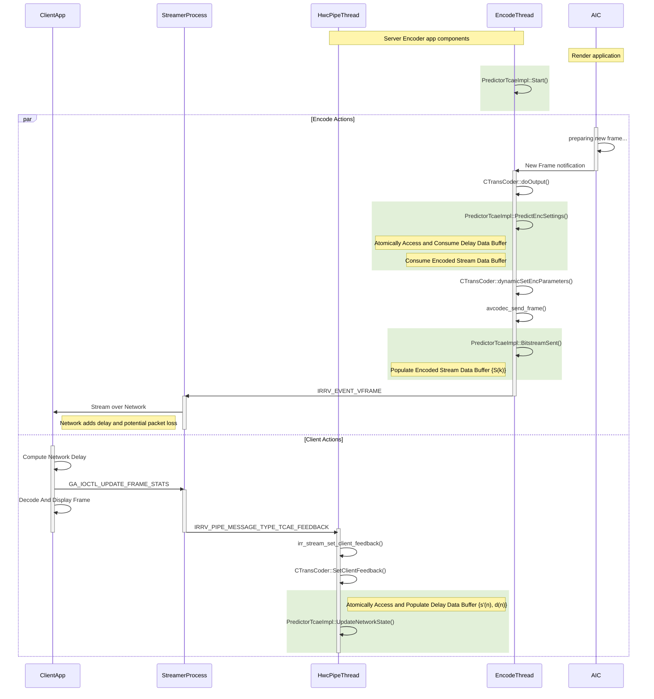

# Transport & Content Adaptive Encode (TCAE)

## Introduction

Experiments show that there is a sharp increase in the latency of
packets received by a client when the network throughput drops below the
rate at which the packets are generated by the server. In usage models
such as Network Gaming or Real-time Video streaming, such an increase in
latency implies poor user experience to the point of failure.
The Android and Windows Cloud Gaming solutions, which target the 
Intel® Data Center GPU Flex series are good examples of a usage model
where the user experience is extremely sensitive to overall latency
in the system.

Transport and Content Adaptive Encode (TCAE) feature and the closely
associated Transport Controlled Bitrate Control (TCBRC) are intended to
help mitigate this problem.

### TCBRC

The key idea is that the Bitrate control (BRC) module deployed in the
Intel Media Driver runs in a mode that adjusts bitrate on a per-frame
basis. This feature runs without the need of an expensive "BRC-reset"
that reinitializes the BRC with new configuration parameters to adjust
to the instantaneous network capacity. The app-layer of the SW stack is
expected to provide feedback related to network capacity through the
Device Driver Interface (DDI).

The default Variable BitRate Control mode (VBR) is a more generic
bit-rate control mechanism: It allows for Maximum and Average bitrates
to be specified dynamically (adaptive bitrate feature), but these
parameters adapt relatively slowly across several frames. VBR doesn't
allow frame-specific targets/constraints without a BRC-reset, or in some
cases -- introduction of an IDR frame. In other words, TCBRC offers the
advantage of much faster adaptation to new bit-rate requirements than
VBR and is more suited for a latency-sensitive usage scenario.

### TCAE

The input parameters for TCBRC are expected to be generated by the
application and fed in through the DDI for the Media UMD (or through
OneVPL APIs, which takes care of interfacing the Media UMD). Here, the
customer apps are free to bring in their own IP and implement this in
any suitable manner of their choice. Apps are envisioned to take several
variables into account including network conditions and complexity of
the content in play,and use a suitable algorithm to translate this to
what the UMD expects to enable TCBRC. This process/idea is referred to
as "Transport and Content Adaptive Encode" (TCAE).

Generally speaking, a TCAE implementation at the minimum is expected to
generate a prediction of the frame rate to be delivered by the Encoder
to match the network capability. This can further be extended to take
advantage of more advanced encoding features supported by the Intel
Media Driver SW stack.

## Reference TCAE Implementation

A reference TCAE implementation that generates a target size on a
per-frame basis is provided with both the Windows and Android Cloud
Gaming (CG) solutions - officially termed the \"Cloud Gaming Reference
Stack for Windows\" and the \"Intel Cloud Streaming System Software on
Android (ICS3A)\" respectively.

The feature is enabled by default in the Video Encoder service for both
solutions.
* In the Windows Cloud Gaming solution, it is available as part of the
  Intel® QSV Capture and Stream SDK.
* In ICS3A, it is directly integrated into the [Video Encoder Service](../sources/encoder).
In both cases, the encode apps enable TCAE to predict the instantaneous
bitrate (from frame size) at which encoder should deliver the bitstream.

### Client App Support

TCAE requires a client application that is capable of generating TCAE
feedback data. The required feedback data needs to be supplied in the
format specified by the pre-defined [Control Protocol for Frame
Stats](control_protocol_spec.rst#framestats/).

-   The critical data to supply is in the `framesize` and`framedelay`
    fields of the structure. (The rest can be zero)
-   It is the responsibility of the client application to generate
    accurate data that reflects the size and network latency of the
    packets received. At the minimum, both these fields should be
    positive integers.

The default recommended client applications packaged with the Windows
and Android solutions both support this feedback. TCAE is triggered only
after at least one valid packet of this feedback.

### Bandwidth Adaptivity

The core part of the reference TCAE implementation is primarily devised
as a transient response to occasional drops in network bandwidth. This
assumes that the bitrate requested takes into account the capacity of
the network in use.

-   If that isn\'t the case, and the network throughput is consistently
    below the bitrate requested, the transient nature of this response
    can lead to a pattern where the latency is rising and then falling
    in a cycle. An example is provided in the TCAE result in the section  
    on [TCAE Performance Evaluation](#case-2a-long-term-network-capacity-drop-without-bandwidth-adaptivity).

To mitigate against this, the TCAE algorithm also includes an
enhancement to stabilise the bitrate generated to an estimated
averagevalue of the network capacity if such an oscillation observed.
This enhancement is referred to as \"Bandwidth Adaptivity\".

-   Bandwidth adaptivity is enabled by default when TCAE is enabled. To
    disable this enhancement, pls see below section on Control settings.

### App-Level Control Settings

The parameters that need to be configured for explicit control on the
server side are listed below for each of the CG stacks.

**Android**

The relevant parameters need to be provided on the ICR Encoder command
line. A sample command line is provided below.

-   `-tcae 1` to enable it, and `-tcae 0` to disable the feature.
    (Enabled by default). Note that `ratectrl` parameter must be set to
    VBR to enable TCAE.
-   `tcae_log_path <path>` to specify a path to generate a TCAE event
    log. More info on this in the section on logging (Disabled by
    default).
-   The `maxrate` parameter needs to be programmed explicitly to specify
    the ideal bitrate that should be used by TCAE. This should be
    greater than the target bitrate (specified by the `-b` option)

```
    icr_encoder $i -streaming -res 1280x720 -fr 30 -url irrv:264 -plugin qsv -quality 4 \
    -ratectrl VBR -b 7.5M -maxrate 8M -tcae 1 -hwc_sock /opt/workdir/ipc/hwc-sock -tcae_log_path /home/user/tcaeEvents.log
```

**Windows**

In Windows, the [config files](../sources/streamer/config/) need to be
updated to capture similar settings.

Select the relevant config file for the use case, and edit each of below
settings as required:

-   `enable-tcae = <true/false>` to enable / disable TCAE. (Enabled by
    default). Note that `video-rc = vbr` is required if TCAE is enabled.
    (Default)
-   `video-specific[b] = <target>` to set TCAE Target bitrate. Note that
    this is also used to set VBR Target bitrate for cases where TCAE is
    not enabled.
-   `netpred-target-delay = <integer>` to configure the target latency
    (in ms) at which TCAE starts suppressing frame size in response.
    Default value = 30. Recommended to leave this unchanged unless for
    experimentation.
-   `netpred-records = <integer>` to configure the number of most recent
    data points that will be factored in determining the target bitrate.
    Default value = 100. Recommended to leave this unchanged unless for
    experimentation.

Event logs in Windows are disabled by default. Set environment variable
`TCAE_LOG_ENABLE=1` to generate logs at `C:\Temp\tcaeLogs_PID.log` (PID
is replaced by the runtime process ID for the TCAE thread).

### Logging and Debug Controls

**Latency Logs**

Logging options are available for developers as a debug feature to study
the results and devise improvements. TCAE logs provide basic capability
to capture the network latency data received from the client application
and the response of the encoder.

The controls to enable logging are provided in the above section on
Control parameters. The logs generated are a time-stamped summary of
relevant events in csv format. Here is a sample output:

    FrameDelay,FrameSize,EncSize,PredSize,Feedback_FrameNumber,EncoderThread_FrameNumber,RelativeTimeStamp,Function
    ...
    11650, 37968, 0, 0, 1, 57, 969578, UpdateClientFeedback
    1295, 3177, 0, 0, 2, 57, 980133, UpdateClientFeedback
    0, 0, 0, 16666, 3, 57, 980994, GetTargetSize
    0, 0, 4072, 16666, 3, 57, 984291, UpdateEncodedSize
    7937, 479, 0, 0, 4, 58, 992027, UpdateClientFeedback
    0, 0, 0, 16666, 5, 58, 997961, GetTargetSize
    0, 0, 3525, 16666, 5, 58, 1001358, UpdateEncodedSize
    ...

These logs are not enabled with VBR. A debug feature is available in
both Windows and Android stacks to generate these latency logs for
VBR(for debug/ comparison vs TCAE).

-   To do this, the encoder needs to be run with TCAE enabled, and in
    addition set an environment variable `BRC_OVERRIDE_MODE=1`. This has
    the effect of running the encoder in VBR mode without TCAE, but
    enables logs for client-reported latency and Encoder response.

**Turn off Bandwidth Adaptivity**

The Bandwidth Adaptivity feature is enabled by default. To disable, the
server app needs to be run with environment variable
`TCAE_STEADY_STATE_CHECK=0`.

**Additional Debug Logging**

Additional logs related to the core part of the algorithm can be enabled
with envrironment variable `TCAE_NETPRED_DUMPS=1`. Note that these are
meant to generate traces to debug problems, and not recommended to be
enabled in normal usage flows.

### Limitations and Possible Extensions

*  The reference implementation is limited to a single-layer encode
   design in its current form.
*  The current design is also limited to determining a target size for
   each frame, and passing that along to the encoder.

This can be extended to more sophisticated designs, that have TCAE output
recommendations for IDR frame insertion, dropping frames, resolution change
etc. The design expectation here is that the app responds appropriately
to these recommendations and does the needful next steps in invoking
relevant OneVPL / Media UMD APIs to implement the feature completely.
    

## Software Architecture for Reference Implementation

This section details how the reference TCAE implementation is interfaced
with the rest of the encoder application and describes the architecture
of the implementation.

The core algorithm implemented and the key application interfaces are
equivalent for both the Android and Windows Cloud Gaming stacks. The
data and application flow involved are ultimately the same. However,
since the TCAE implemention for Windows is within the Intel® QSV Capture
and Stream SDK layer, the app needs to package the same data and
settings through the interfaces defined by this SDK. The description
below is based on the Android definition, but it should be
straight-forward to map these to the Capture SDK equivalents.

### TCAE Functions

The `PredictorTcaeImpl` class (declared in 
[enc\_frame\_settings\_predictor.h](../sources/encoder/shared/tcae/enc_frame_settings_predictor.h))
captures the interface to the TCAE functions.
In windows, this class, with minor interface differences makes
up the Intel® QSV Capture and Stream SDK interface for TCAE. The
important functions exposed in this class are the following:

-   `tcaeStatus  Start(TcaeInitParams_t* params);` : Initializes the
    TCAE object with required settings. The following parameters are set
    as part of this call.
    -   `featuresSet` : TCAE features enabled. Default Value =
        `TCAE_MODE_STANDALONE` (only value validated)
    -   `targetDelayInMs` : Value (in milliseconds) below which TCAE
        aims to keep the network latency. Non-zero input is expected.
    -   `bufferedRecordsCount`: Number of client feedback points to
        factor into the TCAE response. (Default value = 100)
-   `tcaeStatus UpdateNetworkState(PerFrameNetworkData_t* data);`:
    Updates the \"Delay Data\" buffer structure with feedback sent
    (asynchronously) from the client. This function acts as the producer
    for this shared buffer. Expected to be called for every receipt of
    client feedback data.
-   `tcaeStatus BitstreamSent(EncodedFrameFeedback_t* bts);` : Records
    the size of the frame that is encoded and streamed over the network
    in the \"Encoded Bitstream size\" buffer. Expected to be called
    after every encoded frame.
-   `tcaeStatus PredictEncSettings(FrameSettings_t* perFrameSettings);`
    : This call runs the TCAE algorithm and generates a target frame
    size (in bytes) for the current frame. This call is the consumer for
    the \"Delay Data\" and the \"Encoded Bitstream size\" shared
    buffers. It updates the \"Reaction model\" used by the algorithm
    with the latest client feedback data.
-   `tcaeStatus Stop();`: Reset all parameters, and clear the shared
    buffers. Invoked as part of the class destructor.

### Application Interface and Data Flow

The sequence diagram below shows how these functions (green highlight) fit
into the architecture of the encoder, along with the data flow involved. Note
that the functions named and thread architecture represented in this diagram
are specific to the Android stack. The TCAE functions described above are
called from two threads that are part of the Encoder application. The
Windows CG stack has two equivalent threads that invoke the TCAE functions
in a similar manner.



After receipt of frame number $n$ in the bitstream (lets say it is encoded
with size $s_n$ bytes), the client asynchronously returns the bitstream
size and the transport latency $d_n$ of the frame. The size returned by
the server may be slightly different from $s_n$ and is denoted by $s'_n$.
The reasons for the difference are transport related and out of scope of
this document. The data $(s_n, d_n)$ is queued into a shared buffer i.e.
\"Delay Data buffer\" by invocation of the `UpdateNetworkState`
function.

At this point, the encoding thread can be ahead by some frames (denoted by
variable $D$), and new frame indexed $k = n + D$ is ready for encode. The
encoding thread invokes the TCAE algorithm through the `PredictEncSettings`
call. This results in the TCAE object dequeing the items in the Delay Data
shared buffer and processing them to determine a target frame size $t_k$
for the current frame. $t_k$ is then passed to the Media driver as part of
the encode submission. 

See the section on [Software Interfaces for TCBRC](#SDK-Level-Interface)
for more info on the specific structures involved


## Appendix: Software Interfaces for TCBRC

This section provides additional information on the relevant software
interfaces involved in leveraging the TC-BRC feature in the Media
Driver. These interfaces are exposed both at the Device Driver Interface
(DDI) level and as part of the Intel OneVPL library.

TCBRC is implemented as a HuC kernel that is integrated in the Media
User Mode driver (UMD). The UMD programs all parameters and resources
required for the kernel to run the HuC microcontroller on the GPU. Some
of these parameters are exposed to app-layer through DDI and expected as
inputs.

### Media Driver Interface

The BRC component takes into account the required bit-rate and
frame-rates to achieve, and recent history of frame sizes (buffer
fullness) to determine what QP should be used to Encode a particular
frame (FrameQP). For special use cases e.g. certain regions of interest
requested to be encoded with a superior quality (the QP-ROI feature), SW
is expected to provide a delta QP map. If such a map is provided, The QP
value for a given region is then computed as the FrameQP + DeltaQP.

The TCBRC mode uses an additional parameter of instant frame size target
for the current frame in determining the FrameQP.

**Libva**

Support for TCBRC is exposed through the Linux DDI (libva interface)
with the following fields for all codecs. This is in addition to the
fields configured for bitrate-control.

-   `VA_RC_TCBRC`: Field indicating Transport Controlled BRC Specific
    bitrate control for real time streaming. This is part of the
    `VAConfigAttribRateControl` structure. If enabled, the Application
    can provide transport related feedback to driver through below
    field.
-   `target_frame_size`: Field indicating Desired frame size in bytes.
    Libva has following recommendation: When channel condition is very
    good (almost no constraint on instant frame size), the app should
    set target frame size as zero. Otherwise, channel capacity divided
    by fps should be used.

### SDK Level Interface

The fields intended to program TCBRC settings are exposed for apps to
control through the Intel OneVPL library as well. Here are the relevant
fields, all of which need to be set according to the expectations
described below. The Media driver interface for the relevant OS is
internally invoked by OneVPL.

-   `LowDelayBRC`: This is part of `struct mfxExtCodingOption3`, a
    structure to specify additional encode options. This parameter needs
    to be set to `MFX_CODINGOPTION_ON`
-   `NalHrdConformance`: This is part of `struct mfxExtCodingOption3`.
    Note that this parameter does not apply to the AV1 Codec. This
    parameter needs to be set to `MFX_CODINGOPTION_OFF` for AVC and HEVC
    codecs.
-   `RateControlMethod`: This is part of the `mfxInfoMFX` structure,
    which is in turn a part of `mfxVideoParam`, a structure which
    specifies fundamental encoder configuration options. This parameter
    needs to be set to one of the following:
    -   MFX\_RATECONTROL\_VBR
    -   MFX\_RATECONTROL\_QVBR
    -   MFX\_RATECONTROL\_VCM
-   `TargetKbps`: This is also part of the `mfxInfoMFX` structure. This
    is the field that captures the estimated instantaneous bitrate TCBRC
    is expected to support. The following formula can be used to convert
    the target FrameSize into a bit-rate.
    -   `TargetKbps = TargetFrameSizeInBytes * frameRate * 8.0 / 1000.0;`
-   `MaxKbps`: This is also a part of the `mfxInfoMFX` structure.
    -   The MaxKbps parameter must be set the same as the TargetKbps
        parameter for TCAE.

**A Note on the Reference Implementation**

The reference TCAE implementation uses the SDK-level interface for both
Android and Windows CG stacks indirectly. 
* In the Android version, the OneVPL SDK interface is leveraged through
  ffmpeg library with Intel QuickSync Video (QSV) support. Please refer
  to [ffmpeg build template](../templates/ffmpeg.m4) for build detail.
* For the Windows version, the Intel® QSV Capture and Stream SDK interfaces
  with the OneVPL library as required.

The SW stack configures `LowDelayBRC = MFX_CODINGOPTION_ON`, and
`RateControlMethod = MFX_RATECONTROL_VBR` as part of initialization at
the start of the Encode session.

Once there is valid client feedback, a target frame size is computed by
the TCAE algorithm implementation, and it is fed to the SDK interface as
input for every frame. If there is no feedback ever received from the
client, the equivalent of target frame size of \'0\' is supplied,
effectively running the solution in default VBR mode configuration.

As indicated in the Algorithm section, once valid client feedback is
received (i.e. initialized), any gaps in receipt of subsequent
network-delay related feedback are perceived to be a result of network
congestion, and the TCAE algorithm implementation accounts for this
scenario in computing the target frame size.
